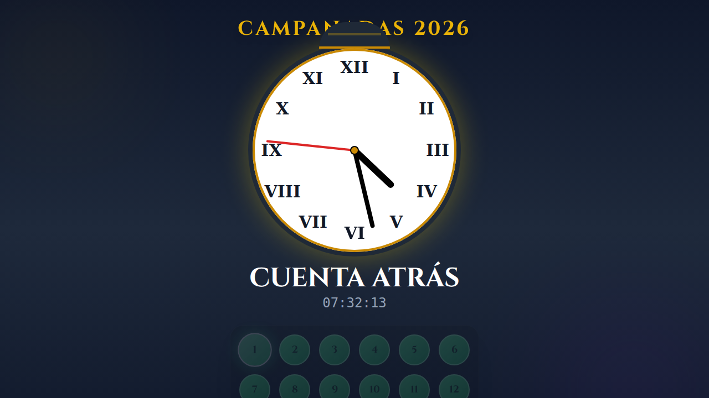

# 🍇 12 Grapes Countdown

This is a New Year's countdown application themed around the Spanish tradition of eating 12 grapes, one for each chime of the clock at midnight.

This project was coded by Jules, an AI software engineer, with a human project manager overseeing the development.

## Screenshot



## Running the Application

To run this application on your local machine, follow these steps:

1.  **Install dependencies:**
    ```bash
    npm install
    ```

2.  **Run the development server:**
    ```bash
    npm run dev
    ```

The application will be available at [campanadas.zik.es](https://campanadas.zik.es/).
